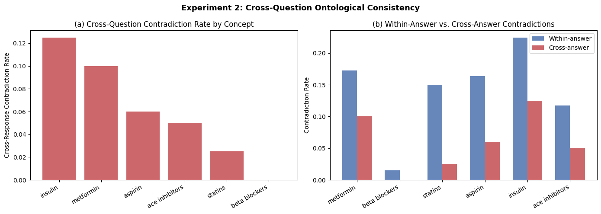
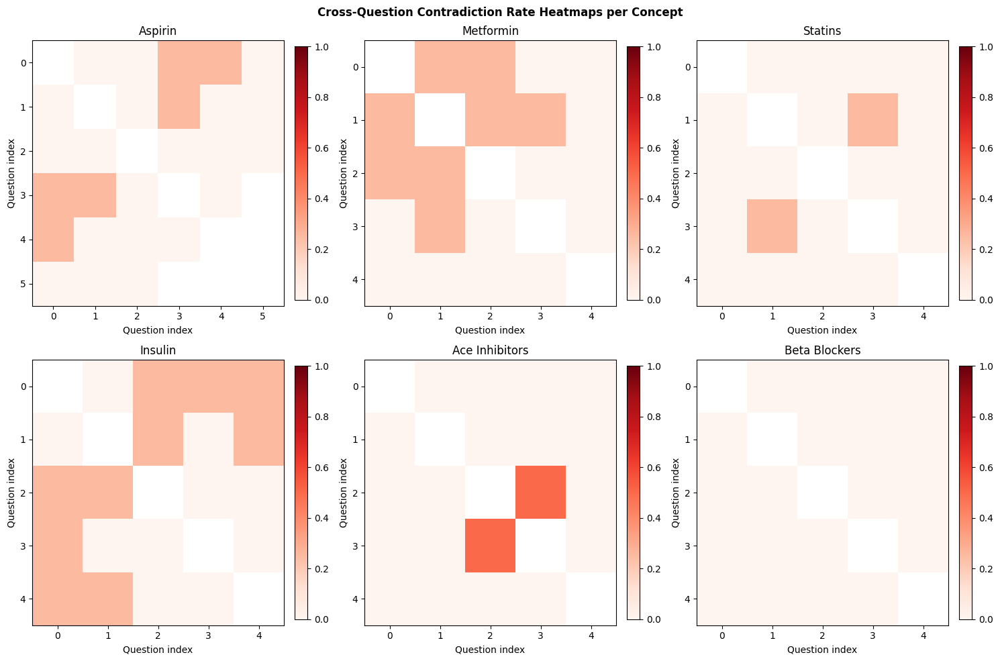

# Experiment Results

---

## Experiment 1 — Cross-Model Semantic Leakage Benchmark

We ran four models on 40 biomedical questions and measured how often their reasoning steps contradict each other.

**Setup**

| Parameter | Value |
|-----------|-------|
| Models | claude-haiku, gpt-4o-mini, gemini-flash, llama-3-70b |
| Questions | 40 (PubMedQA / MedQA) |
| NLI mode | Heuristic (token overlap + negation/direction patterns) |
| UMLS | Not configured |
| Total runs | 160 (4 models × 40 questions) |

---

### Figure 1 — Per-Model Contradiction Rates

**(a) Contradiction rate per model (boxplot)**

| Model | Median Rate | Outliers up to |
|-------|------------|----------------|
| claude-haiku | ~10% | 38% |
| gpt-4o-mini | ~1% | 43% |
| gemini-flash | ~10% | 50% |
| llama-3-70b | ~12% | 25% |

GPT-4o-mini is the most consistent — its answers tend to move in one direction without pivoting. Claude-haiku and gemini-flash both hit ~10% median but occasionally spike much higher on specific questions.

**(b) NLI label breakdown per model (stacked bar)**

Claude-haiku and gemini-flash write longer answers (~12 step-pairs per question vs ~7 for the others). Across 40 questions, the heuristic does pick up entailment — consecutive steps do sometimes share enough vocabulary to count. The absolute number of contradictions is higher for longer chains simply because there are more pairs to score.

**(c) Concept validity scatter**

Empty — UMLS wasn't configured for this run. Would show whether questions with vague, un-linkable concepts also tend to have higher contradiction rates.

---

### Figure 2 — Contradiction Rate vs. Reasoning Depth

Both panels plot step-pair position in the chain (0 = first pair) against contradiction rate / probability.

The general pattern: contradiction risk increases as the chain gets longer. Early steps tend to establish a mechanism, and later steps tend to introduce caveats or exceptions — that's when the direction flip gets flagged. GPT-4o-mini stays flat because its chains are short. The gemini-flash spike at depth ~22 comes from a single very long answer, so it's not statistically meaningful.

---

### Figure 3 — Guard Signal Analysis

**(a) How often each guard fires per model**

| Model | caution_band | direction_conflict | lexical_duplicate |
|-------|--------------:|-------------------:|------------------:|
| claude-haiku | ~5.4 | ~1.2 | 0 |
| gemini-flash | ~5.0 | ~0.9 | 0 |
| gpt-4o-mini | ~2.5 | ~0.5 | 0 |
| llama-3-70b | ~3.0 | ~0.7 | 0 |

`lexical_duplicate` is always zero — models don't copy-paste steps verbatim. `caution_band` fires a lot because all models use hedging language ("however", "may vary", "in some cases"), which is normal for biomedical reasoning.

**(b) Do the guards actually flag contradictions?**

| Guard | Fires on contradiction pairs | Fires on other pairs |
|-------|---------------------------:|--------------------:|
| direction_conflict | 28% | 5% |
| caution_band | 5% | 43% |

`direction_conflict` is the useful one — it fires 5.6× more often on actual contradictions than on normal pairs. `caution_band` is essentially backwards for this purpose: it fires more on *non*-contradiction pairs because hedging language appears during topic transitions, not polarity flips. It's better treated as an "uncertain, worth reviewing" signal rather than a contradiction detector.

---

### Limitations

| Issue | Impact | Fix |
|-------|--------|-----|
| Heuristic NLI only | No semantic entailment; only catches surface patterns | Run with full PubMedBERT-BioNLI-LoRA model |
| UMLS not configured | Concept validity panel empty | Add UMLS API key (free at uts.nlm.nih.gov) |
| Gemini depth spike | Only 1–2 questions reach depth 22+ — not robust | More questions, or stratify by chain length |
| No human labels | All contradiction calls are automated | See Exp 3 for 120 hand-labeled pairs |

---

---

## Experiment 2 — Cross-Question Consistency

The standard pipeline checks whether step 3 contradicts step 4 *within one answer*. This experiment asks a different question: does the model say inconsistent things about the *same concept* across *different questions*?

**Setup**

| Parameter | Value |
|-----------|-------|
| Models | claude-haiku, gpt-4o-mini, gemini-flash, llama-3-70b |
| Concepts | 6: aspirin, metformin, statins, insulin, ACE inhibitors, beta blockers |
| Questions | 5–6 per concept (30 total) |
| Cross-question pairs | Up to 50 step-pairs per concept, drawn from different questions |

---

### Figure 4 — Cross-Question Contradiction Rates

**(a) Cross-question contradiction rate by concept**

| Concept | Cross-answer rate |
|---------|------------------:|
| Insulin | ~12.5% |
| Metformin | ~10.0% |
| Aspirin | ~6.0% |
| ACE Inhibitors | ~5.0% |
| Statins | ~2.5% |
| Beta Blockers | ~0.0% |

Insulin is the most inconsistent across questions, which makes sense — insulin's role looks quite different depending on whether you're asking about type 1 vs type 2 diabetes, or normal physiology vs insulin resistance. Beta blockers are the most consistent: the mechanism (blocking β1 receptors → lower heart rate) is the same no matter how you ask about it.

**(b) Within-answer vs. cross-answer**

| Concept | Within-answer | Cross-answer |
|---------|-------------:|-------------:|
| Insulin | ~22.5% | ~12.5% |
| Metformin | ~17.5% | ~10.0% |
| Aspirin | ~16.5% | ~6.0% |
| Statins | ~15.0% | ~2.5% |
| ACE Inhibitors | ~11.5% | ~5.0% |
| Beta Blockers | ~1.5% | ~0.0% |

Models actually contradict themselves *more* within a single answer than across separate answers about the same concept. This is because within one CoT chain, the model builds up a mechanism and then pivots to mention side effects or exceptions — that pivot gets flagged as a contradiction. When answering separate questions, each response starts fresh and stays more directionally consistent. The effect is largest for statins (6× higher within-answer rate) where the HMG-CoA mechanism → myopathy pivot is a very common pattern.

---

### Figure 5 — Cross-Question Heatmaps per Concept

Each grid shows which pairs of questions within a concept group contradict each other. White = no contradiction, dark red = always contradicts.

**Aspirin** — light pink spread across most pairs. Aspirin has competing effects (protects the heart, can cause stomach bleeding) so mild inconsistency shows up regardless of which two questions are compared.

**Metformin** — one very dark cell at (Q0, Q1): "how does metformin work" vs "when is metformin contraindicated". The mechanism answer says it reduces liver glucose output; the contraindication answer introduces renal failure risk and lactic acidosis. The NLI model sees these as conflicting directions.

**Statins** — mostly light, with one hotspot at (Q1, Q3): "do statins reduce stroke risk?" vs "do statins reduce mortality in heart failure?". Evidence is strong for stroke, mixed for heart failure, so the model's confidence differs.

**Insulin** — broadly pink across many pairs. Insulin physiology is genuinely context-dependent so the model produces different framing depending on the question, leading to diffuse inconsistency rather than one focal pair.

**ACE inhibitors** — hotspot clustered around Q2/Q3/Q4: "do they protect kidney function" vs "what are the adverse effects" vs "can they cause hyperkalemia". ACE inhibitors protect kidneys in early diabetic nephropathy but can damage them in dehydrated patients — the model captures both sides but doesn't reconcile them.

**Beta blockers** — almost entirely white. The mechanism is simple and consistent across all question types.

---

### Limitations

| Issue | Impact | Fix |
|-------|--------|-----|
| Heuristic NLI | May miss semantic contradictions | Use full NLI model |
| Only 5–6 questions per concept | Heatmap cells can represent just 1–2 pairs | Expand to 10–15 questions per concept |
| Cross-NLI only run on primary model | Other models cached but not compared cross-question | Run separately per model |
| No human labels | All calls are automated | Annotate top contradiction examples manually |
